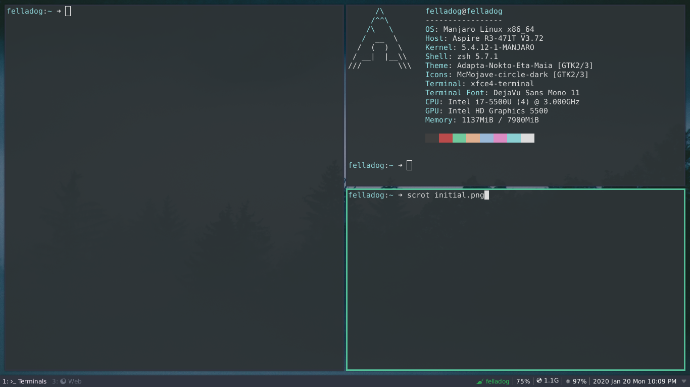

# Dotfiles

- **Save your config before trying**
- Need
  - zsh
  - bspwm [current WM]
  - [alacritty](https://github.com/alacritty/alacritty) [current Terminal Emulator]
  - neofetch
  - polybar
  - vim
  - neovim
  - i3
  - rofi
  - xfce4-terminal
  - mononoki regualr font
  - ncmpcpp
  - zathura

- Install [stow](https://www.gnu.org/software/stow/manual/stow.html#Introduction)

```
  $ git clone https://github.com/utsavdarlami/dotfiles.git
  $ cd dotfiles
  $ bash adoptAndSymlink.sh
```

- Rofi menu and applets installation :
    - https://github.com/adi1090x/rofi#installation

## ScreenShot

- Dec 11 2020 [latest]
    
    

| Obsidian Graph                                                | Obsidain and vimwiki                                                      |
| -                                                             | -                                                                         |
|  |  |
  
| ncmpcpp                                 | Firefox                                |
| -                                       | -                                      |
|  |  |

- June 24 2020 
  
    
    
    
    
- Feb 24 2020 
    

- Feb 22 2020
    

- Jan 21 2020
    

- Aug 14 2019
    
